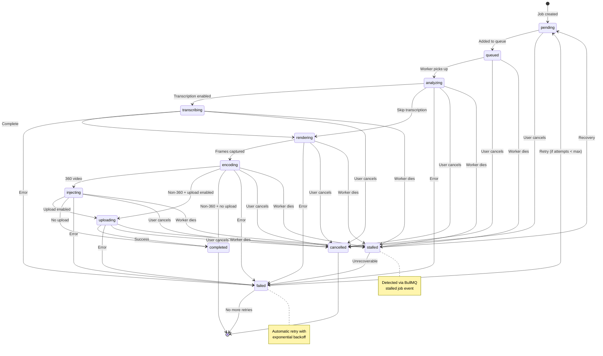

# Render Job Data Schema

**Project:** Ethereal Flame Studio
**Created:** 2026-01-28
**Status:** Definitive Reference
**Version:** 1.0.0

---

## Overview

This document defines the complete data layer schema for the Ethereal Flame Studio render pipeline. It serves as the single source of truth for:

- TypeScript interfaces used throughout the application
- SQLite database schema for job persistence
- BullMQ job data structures
- API request/response formats
- Webhook payloads for external integrations
- File naming conventions

---

## Table of Contents

1. [TypeScript Interfaces](#1-typescript-interfaces)
2. [SQLite Schema](#2-sqlite-schema)
3. [BullMQ Job Structures](#3-bullmq-job-structures)
4. [Webhook Payloads](#4-webhook-payloads)
5. [API Schemas](#5-api-schemas)
6. [File Naming Convention](#6-file-naming-convention)
7. [State Machine](#7-state-machine)

---

## 1. TypeScript Interfaces

### Core Types

```typescript
// src/lib/render/schema/types.ts

/**
 * Unique identifier types for type safety
 */
export type JobId = string & { readonly __brand: 'JobId' };
export type BatchId = string & { readonly __brand: 'BatchId' };
export type MachineId = string & { readonly __brand: 'MachineId' };

/**
 * Generate typed IDs
 */
export function createJobId(): JobId {
  return `job_${Date.now()}_${crypto.randomUUID().slice(0, 8)}` as JobId;
}

export function createBatchId(): BatchId {
  return `batch_${Date.now()}_${crypto.randomUUID().slice(0, 8)}` as BatchId;
}
```

### JobStatus (State Machine)

```typescript
/**
 * All possible states for a render job.
 * Transitions are strictly controlled - see State Machine section.
 */
export type JobStatus =
  | 'pending'       // Job created, waiting in queue
  | 'queued'        // Added to BullMQ, waiting for worker
  | 'analyzing'     // Pre-analyzing audio (extracting amplitude data)
  | 'transcribing'  // Running Whisper transcription
  | 'rendering'     // Capturing frames
  | 'encoding'      // FFmpeg encoding frames to video
  | 'injecting'     // Adding VR metadata (360 only)
  | 'uploading'     // Uploading to Google Drive
  | 'completed'     // Successfully finished
  | 'failed'        // Error occurred, may retry
  | 'cancelled'     // User cancelled
  | 'stalled';      // Worker died mid-job, needs recovery

/**
 * Status metadata for UI display
 */
export const JOB_STATUS_META: Record<JobStatus, {
  label: string;
  color: string;
  isTerminal: boolean;
  isActive: boolean;
}> = {
  pending:      { label: 'Pending',      color: 'gray',   isTerminal: false, isActive: false },
  queued:       { label: 'Queued',       color: 'blue',   isTerminal: false, isActive: false },
  analyzing:    { label: 'Analyzing',    color: 'cyan',   isTerminal: false, isActive: true },
  transcribing: { label: 'Transcribing', color: 'purple', isTerminal: false, isActive: true },
  rendering:    { label: 'Rendering',    color: 'orange', isTerminal: false, isActive: true },
  encoding:     { label: 'Encoding',     color: 'yellow', isTerminal: false, isActive: true },
  injecting:    { label: 'VR Metadata',  color: 'indigo', isTerminal: false, isActive: true },
  uploading:    { label: 'Uploading',    color: 'green',  isTerminal: false, isActive: true },
  completed:    { label: 'Completed',    color: 'green',  isTerminal: true,  isActive: false },
  failed:       { label: 'Failed',       color: 'red',    isTerminal: true,  isActive: false },
  cancelled:    { label: 'Cancelled',    color: 'gray',   isTerminal: true,  isActive: false },
  stalled:      { label: 'Stalled',      color: 'red',    isTerminal: false, isActive: false },
};
```

### RenderSettings (Visual Parameters)

```typescript
/**
 * Visual rendering configuration - subset of template settings
 * that affect the rendered output.
 */
export interface RenderSettings {
  /** Template ID to use (null = use provided settings) */
  templateId: string | null;

  /** Visual mode: 'flame' | 'mist' */
  visualMode: 'flame' | 'mist';

  /** Overall effect intensity (0-2) */
  intensity: number;

  /** Skybox preset name */
  skyboxPreset: string;

  /** Skybox rotation speed (0-1) */
  skyboxRotationSpeed: number;

  /** Enable water reflection plane */
  waterEnabled: boolean;

  /** Water color (hex string) */
  waterColor: string;

  /** Water reflectivity (0-1) */
  waterReflectivity: number;

  /** Particle layer configurations (serialized) */
  particleLayers: ParticleLayerSerialized[];
}

/**
 * Serialized particle layer (JSON-safe)
 */
export interface ParticleLayerSerialized {
  id: string;
  enabled: boolean;
  particleCount: number;
  baseSize: number;
  colorStart: string;
  colorEnd: string;
  velocityMultiplier: number;
  turbulence: number;
  audioReactivity: {
    sizeSensitivity: number;
    velocitySensitivity: number;
    colorShiftSensitivity: number;
  };
}
```

### AudioAnalysis (Pre-analyzed Audio Data)

```typescript
/**
 * Pre-analyzed audio data for offline rendering.
 * Generated by PreAnalyzer, stored for render worker.
 */
export interface AudioAnalysis {
  /** Audio file hash for cache validation */
  audioHash: string;

  /** Total duration in seconds */
  durationSeconds: number;

  /** Target frames per second */
  fps: 30 | 60;

  /** Total frame count */
  totalFrames: number;

  /** Sample rate of source audio */
  sampleRate: number;

  /** Per-frame audio data */
  frames: FrameAudioData[];

  /** Analysis metadata */
  metadata: {
    analyzedAt: string;  // ISO timestamp
    analyzerVersion: string;
    peakAmplitude: number;
    averageAmplitude: number;
    dominantFrequency: number;
  };
}

/**
 * Audio data for a single frame
 */
export interface FrameAudioData {
  /** Frame index (0-based) */
  frame: number;

  /** Timestamp in seconds */
  timestamp: number;

  /** Normalized amplitude (0-1) */
  amplitude: number;

  /** Bass frequency energy (0-1) */
  bass: number;

  /** Mid frequency energy (0-1) */
  mid: number;

  /** Treble frequency energy (0-1) */
  treble: number;

  /** Frequency spectrum (optional, for advanced effects) */
  spectrum?: number[];
}
```

### WhisperResult (Transcription Output)

```typescript
/**
 * Whisper transcription result from faster-whisper service.
 */
export interface WhisperResult {
  /** Full transcription text */
  text: string;

  /** Detected language code (e.g., 'en', 'es') */
  language: string;

  /** Language detection confidence (0-1) */
  languageConfidence: number;

  /** Processing duration in seconds */
  processingTime: number;

  /** Model used for transcription */
  model: 'tiny' | 'base' | 'small' | 'medium' | 'large-v3';

  /** Word-level segments with timestamps */
  segments: WhisperSegment[];

  /** Metadata about the transcription */
  metadata: {
    audioPath: string;
    audioDuration: number;
    transcribedAt: string;  // ISO timestamp
  };
}

/**
 * Individual transcription segment
 */
export interface WhisperSegment {
  /** Segment index */
  id: number;

  /** Start time in seconds */
  start: number;

  /** End time in seconds */
  end: number;

  /** Segment text */
  text: string;

  /** Confidence score (0-1) */
  confidence: number;

  /** Word-level timestamps (if available) */
  words?: WhisperWord[];
}

/**
 * Word-level timing information
 */
export interface WhisperWord {
  word: string;
  start: number;
  end: number;
  confidence: number;
}
```

### RenderOutput (Per-format Output)

```typescript
/**
 * Output format specification
 */
export type OutputFormat =
  | 'flat-1080p-landscape'   // 1920x1080
  | 'flat-1080p-portrait'    // 1080x1920
  | 'flat-4k-landscape'      // 3840x2160
  | 'flat-4k-portrait'       // 2160x3840
  | '360-mono-4k'            // 4096x2048 equirectangular
  | '360-mono-6k'            // 6144x3072 equirectangular
  | '360-mono-8k'            // 8192x4096 equirectangular
  | '360-stereo-8k';         // 8192x8192 top/bottom stereo

/**
 * Output format metadata
 */
export const OUTPUT_FORMAT_META: Record<OutputFormat, {
  width: number;
  height: number;
  is360: boolean;
  isStereo: boolean;
  aspectRatio: string;
  estimatedFileSizeMB: (durationSec: number, fps: number) => number;
}> = {
  'flat-1080p-landscape': {
    width: 1920, height: 1080, is360: false, isStereo: false,
    aspectRatio: '16:9',
    estimatedFileSizeMB: (dur, fps) => dur * fps * 0.015,
  },
  'flat-1080p-portrait': {
    width: 1080, height: 1920, is360: false, isStereo: false,
    aspectRatio: '9:16',
    estimatedFileSizeMB: (dur, fps) => dur * fps * 0.015,
  },
  'flat-4k-landscape': {
    width: 3840, height: 2160, is360: false, isStereo: false,
    aspectRatio: '16:9',
    estimatedFileSizeMB: (dur, fps) => dur * fps * 0.06,
  },
  'flat-4k-portrait': {
    width: 2160, height: 3840, is360: false, isStereo: false,
    aspectRatio: '9:16',
    estimatedFileSizeMB: (dur, fps) => dur * fps * 0.06,
  },
  '360-mono-4k': {
    width: 4096, height: 2048, is360: true, isStereo: false,
    aspectRatio: '2:1',
    estimatedFileSizeMB: (dur, fps) => dur * fps * 0.08,
  },
  '360-mono-6k': {
    width: 6144, height: 3072, is360: true, isStereo: false,
    aspectRatio: '2:1',
    estimatedFileSizeMB: (dur, fps) => dur * fps * 0.15,
  },
  '360-mono-8k': {
    width: 8192, height: 4096, is360: true, isStereo: false,
    aspectRatio: '2:1',
    estimatedFileSizeMB: (dur, fps) => dur * fps * 0.25,
  },
  '360-stereo-8k': {
    width: 8192, height: 8192, is360: true, isStereo: true,
    aspectRatio: '1:1',
    estimatedFileSizeMB: (dur, fps) => dur * fps * 0.5,
  },
};

/**
 * Completed output information
 */
export interface RenderOutput {
  /** Output format that was rendered */
  format: OutputFormat;

  /** Local file path to rendered video */
  localPath: string;

  /** File size in bytes */
  fileSizeBytes: number;

  /** Video duration in seconds */
  durationSeconds: number;

  /** Actual resolution (may differ slightly from target) */
  resolution: {
    width: number;
    height: number;
  };

  /** Encoding settings used */
  encoding: {
    codec: 'h264' | 'h265' | 'vp9';
    bitrate: number;  // kbps
    crf: number;
    preset: string;
  };

  /** Google Drive URL (if uploaded) */
  gdriveUrl: string | null;

  /** Google Drive file ID (if uploaded) */
  gdriveFileId: string | null;

  /** VR metadata injection status (360 only) */
  vrMetadata?: {
    injected: boolean;
    spherical: boolean;
    stereoMode: 'mono' | 'top-bottom' | null;
    projectionType: 'equirectangular';
  };

  /** Timestamps */
  renderStartedAt: string;
  renderCompletedAt: string;
  uploadedAt: string | null;
}
```

### RenderJob (Main Job Structure)

```typescript
/**
 * Complete render job - the main entity.
 * This is the source of truth for a render operation.
 */
export interface RenderJob {
  /** Unique job identifier */
  id: JobId;

  /** Batch ID if part of a batch (null for single jobs) */
  batchId: BatchId | null;

  /** Current job status */
  status: JobStatus;

  /** Progress percentage (0-100) */
  progress: number;

  /** Current stage description for UI */
  currentStage: string;

  // === Audio Input ===

  /** Original audio file name */
  audioName: string;

  /** Path to audio file on render machine */
  audioPath: string;

  /** Audio file hash (SHA-256) for cache validation */
  audioHash: string;

  /** Audio duration in seconds */
  audioDuration: number;

  // === Render Configuration ===

  /** Output format to render */
  outputFormat: OutputFormat;

  /** Frames per second */
  fps: 30 | 60;

  /** Visual settings for rendering */
  renderSettings: RenderSettings;

  /** Target render machine ID */
  targetMachineId: MachineId | null;

  // === Outputs ===

  /** Rendered output details (populated on completion) */
  output: RenderOutput | null;

  /** Whisper transcription result (if enabled) */
  whisperResult: WhisperResult | null;

  /** Pre-analyzed audio data (stored separately, referenced here) */
  audioAnalysisPath: string | null;

  // === Metadata ===

  /** Job priority (1 = highest, 10 = lowest) */
  priority: number;

  /** Retry attempt count */
  attemptCount: number;

  /** Maximum retry attempts */
  maxAttempts: number;

  /** Error message if failed */
  errorMessage: string | null;

  /** Error stack trace (for debugging) */
  errorStack: string | null;

  /** Worker ID that processed this job */
  workerId: string | null;

  // === Timestamps ===

  /** Job creation time */
  createdAt: string;

  /** Time job was queued to BullMQ */
  queuedAt: string | null;

  /** Time job started processing */
  startedAt: string | null;

  /** Time job completed or failed */
  completedAt: string | null;

  /** Last status update time */
  updatedAt: string;

  // === External References ===

  /** YouTube video ID (if published) */
  youtubeVideoId: string | null;

  /** YouTube video URL */
  youtubeUrl: string | null;

  /** Custom user metadata */
  userMetadata: Record<string, unknown>;
}

/**
 * Minimal job data for list views
 */
export interface RenderJobSummary {
  id: JobId;
  batchId: BatchId | null;
  status: JobStatus;
  progress: number;
  audioName: string;
  outputFormat: OutputFormat;
  createdAt: string;
  completedAt: string | null;
  errorMessage: string | null;
}
```

### RenderMachine (Multi-machine Support)

```typescript
/**
 * Render machine configuration
 */
export interface RenderMachine {
  /** Unique machine identifier */
  id: MachineId;

  /** Display name */
  name: string;

  /** Cloudflare Tunnel URL */
  tunnelUrl: string;

  /** Machine capabilities */
  capabilities: {
    /** Maximum output resolution */
    maxResolution: '1080p' | '4k' | '6k' | '8k';

    /** GPU VRAM in GB */
    vramGB: number;

    /** Can render 360 stereo */
    supports360Stereo: boolean;

    /** Can run Whisper transcription */
    supportsWhisper: boolean;

    /** Whisper model available */
    whisperModel?: 'tiny' | 'base' | 'small' | 'medium' | 'large-v3';
  };

  /** Machine status */
  status: 'online' | 'offline' | 'busy' | 'maintenance';

  /** Current queue depth */
  queueDepth: number;

  /** Priority (1 = prefer, higher = fallback) */
  priority: number;

  /** Last health check timestamp */
  lastHealthCheck: string;

  /** Last health check result */
  healthCheckResult: {
    healthy: boolean;
    gpuAvailable: boolean;
    diskSpaceGB: number;
    memoryUsagePercent: number;
    errorMessage: string | null;
  } | null;
}
```

---

## 2. SQLite Schema

### Main Schema

```sql
-- src/lib/db/schema.sql

-- ============================================================
-- RENDER JOBS TABLE
-- Primary table for all render job records
-- ============================================================

CREATE TABLE IF NOT EXISTS render_jobs (
  -- Primary key
  id TEXT PRIMARY KEY,

  -- Batch reference (nullable for single jobs)
  batch_id TEXT,

  -- Current status (see JobStatus type)
  status TEXT NOT NULL DEFAULT 'pending'
    CHECK(status IN (
      'pending', 'queued', 'analyzing', 'transcribing',
      'rendering', 'encoding', 'injecting', 'uploading',
      'completed', 'failed', 'cancelled', 'stalled'
    )),

  -- Progress (0-100)
  progress REAL DEFAULT 0,

  -- Current stage description
  current_stage TEXT DEFAULT '',

  -- Audio input
  audio_name TEXT NOT NULL,
  audio_path TEXT NOT NULL,
  audio_hash TEXT,
  audio_duration REAL,

  -- Render configuration
  output_format TEXT NOT NULL
    CHECK(output_format IN (
      'flat-1080p-landscape', 'flat-1080p-portrait',
      'flat-4k-landscape', 'flat-4k-portrait',
      '360-mono-4k', '360-mono-6k', '360-mono-8k',
      '360-stereo-8k'
    )),
  fps INTEGER NOT NULL DEFAULT 30 CHECK(fps IN (30, 60)),
  render_settings TEXT,  -- JSON blob
  target_machine_id TEXT,

  -- Output (JSON blob, populated on completion)
  output TEXT,

  -- Whisper result (JSON blob)
  whisper_result TEXT,

  -- Path to pre-analyzed audio data file
  audio_analysis_path TEXT,

  -- Job metadata
  priority INTEGER DEFAULT 5 CHECK(priority BETWEEN 1 AND 10),
  attempt_count INTEGER DEFAULT 0,
  max_attempts INTEGER DEFAULT 3,
  error_message TEXT,
  error_stack TEXT,
  worker_id TEXT,

  -- Timestamps (ISO 8601)
  created_at TEXT NOT NULL DEFAULT (datetime('now')),
  queued_at TEXT,
  started_at TEXT,
  completed_at TEXT,
  updated_at TEXT NOT NULL DEFAULT (datetime('now')),

  -- External references
  youtube_video_id TEXT,
  youtube_url TEXT,

  -- Custom user metadata (JSON blob)
  user_metadata TEXT DEFAULT '{}'
);

-- ============================================================
-- RENDER OUTPUTS TABLE
-- Detailed output information (one per format per job)
-- ============================================================

CREATE TABLE IF NOT EXISTS render_outputs (
  id TEXT PRIMARY KEY,
  job_id TEXT NOT NULL REFERENCES render_jobs(id) ON DELETE CASCADE,

  -- Output details
  format TEXT NOT NULL,
  local_path TEXT NOT NULL,
  file_size_bytes INTEGER,
  duration_seconds REAL,
  width INTEGER,
  height INTEGER,

  -- Encoding info (JSON)
  encoding TEXT,

  -- Google Drive
  gdrive_url TEXT,
  gdrive_file_id TEXT,

  -- VR metadata (JSON, for 360 only)
  vr_metadata TEXT,

  -- Timestamps
  render_started_at TEXT,
  render_completed_at TEXT,
  uploaded_at TEXT,

  created_at TEXT NOT NULL DEFAULT (datetime('now'))
);

-- ============================================================
-- BATCHES TABLE
-- Batch job groupings
-- ============================================================

CREATE TABLE IF NOT EXISTS batches (
  id TEXT PRIMARY KEY,
  name TEXT,
  status TEXT DEFAULT 'pending'
    CHECK(status IN ('pending', 'processing', 'completed', 'failed', 'cancelled')),

  -- Batch configuration
  template_id TEXT,
  output_formats TEXT,  -- JSON array of formats
  target_machine_id TEXT,

  -- Statistics
  total_jobs INTEGER DEFAULT 0,
  completed_jobs INTEGER DEFAULT 0,
  failed_jobs INTEGER DEFAULT 0,

  -- Timestamps
  created_at TEXT NOT NULL DEFAULT (datetime('now')),
  started_at TEXT,
  completed_at TEXT,
  updated_at TEXT NOT NULL DEFAULT (datetime('now'))
);

-- ============================================================
-- RENDER MACHINES TABLE
-- Available render machine registry
-- ============================================================

CREATE TABLE IF NOT EXISTS render_machines (
  id TEXT PRIMARY KEY,
  name TEXT NOT NULL,
  tunnel_url TEXT NOT NULL,

  -- Capabilities (JSON)
  capabilities TEXT NOT NULL,

  -- Status
  status TEXT DEFAULT 'offline'
    CHECK(status IN ('online', 'offline', 'busy', 'maintenance')),
  queue_depth INTEGER DEFAULT 0,
  priority INTEGER DEFAULT 1,

  -- Health check
  last_health_check TEXT,
  health_check_result TEXT,  -- JSON

  created_at TEXT NOT NULL DEFAULT (datetime('now')),
  updated_at TEXT NOT NULL DEFAULT (datetime('now'))
);

-- ============================================================
-- WHISPER CACHE TABLE
-- Cache transcription results by audio hash
-- ============================================================

CREATE TABLE IF NOT EXISTS whisper_cache (
  audio_hash TEXT PRIMARY KEY,
  result TEXT NOT NULL,  -- JSON WhisperResult
  model TEXT NOT NULL,
  created_at TEXT NOT NULL DEFAULT (datetime('now'))
);

-- ============================================================
-- AUDIO ANALYSIS CACHE TABLE
-- Cache pre-analyzed audio by hash
-- ============================================================

CREATE TABLE IF NOT EXISTS audio_analysis_cache (
  audio_hash TEXT PRIMARY KEY,
  fps INTEGER NOT NULL,
  analysis_path TEXT NOT NULL,  -- Path to JSON file
  created_at TEXT NOT NULL DEFAULT (datetime('now')),

  UNIQUE(audio_hash, fps)
);

-- ============================================================
-- INDEXES
-- ============================================================

-- Jobs indexes
CREATE INDEX IF NOT EXISTS idx_jobs_batch ON render_jobs(batch_id);
CREATE INDEX IF NOT EXISTS idx_jobs_status ON render_jobs(status);
CREATE INDEX IF NOT EXISTS idx_jobs_created ON render_jobs(created_at);
CREATE INDEX IF NOT EXISTS idx_jobs_updated ON render_jobs(updated_at);
CREATE INDEX IF NOT EXISTS idx_jobs_audio_hash ON render_jobs(audio_hash);
CREATE INDEX IF NOT EXISTS idx_jobs_machine ON render_jobs(target_machine_id);

-- Outputs indexes
CREATE INDEX IF NOT EXISTS idx_outputs_job ON render_outputs(job_id);

-- Batches indexes
CREATE INDEX IF NOT EXISTS idx_batches_status ON batches(status);
CREATE INDEX IF NOT EXISTS idx_batches_created ON batches(created_at);

-- Machines indexes
CREATE INDEX IF NOT EXISTS idx_machines_status ON render_machines(status);

-- ============================================================
-- TRIGGERS
-- ============================================================

-- Auto-update updated_at timestamp
CREATE TRIGGER IF NOT EXISTS trg_jobs_updated
AFTER UPDATE ON render_jobs
BEGIN
  UPDATE render_jobs SET updated_at = datetime('now') WHERE id = NEW.id;
END;

CREATE TRIGGER IF NOT EXISTS trg_batches_updated
AFTER UPDATE ON batches
BEGIN
  UPDATE batches SET updated_at = datetime('now') WHERE id = NEW.id;
END;

CREATE TRIGGER IF NOT EXISTS trg_machines_updated
AFTER UPDATE ON render_machines
BEGIN
  UPDATE render_machines SET updated_at = datetime('now') WHERE id = NEW.id;
END;
```

### Database Helper Functions

```typescript
// src/lib/db/helpers.ts

import Database from 'better-sqlite3';
import { RenderJob, RenderJobSummary, JobStatus } from '../render/schema/types';

/**
 * Convert database row to RenderJob
 */
export function rowToJob(row: Record<string, unknown>): RenderJob {
  return {
    id: row.id as string,
    batchId: row.batch_id as string | null,
    status: row.status as JobStatus,
    progress: row.progress as number,
    currentStage: row.current_stage as string,
    audioName: row.audio_name as string,
    audioPath: row.audio_path as string,
    audioHash: row.audio_hash as string,
    audioDuration: row.audio_duration as number,
    outputFormat: row.output_format as OutputFormat,
    fps: row.fps as 30 | 60,
    renderSettings: row.render_settings ? JSON.parse(row.render_settings as string) : null,
    targetMachineId: row.target_machine_id as string | null,
    output: row.output ? JSON.parse(row.output as string) : null,
    whisperResult: row.whisper_result ? JSON.parse(row.whisper_result as string) : null,
    audioAnalysisPath: row.audio_analysis_path as string | null,
    priority: row.priority as number,
    attemptCount: row.attempt_count as number,
    maxAttempts: row.max_attempts as number,
    errorMessage: row.error_message as string | null,
    errorStack: row.error_stack as string | null,
    workerId: row.worker_id as string | null,
    createdAt: row.created_at as string,
    queuedAt: row.queued_at as string | null,
    startedAt: row.started_at as string | null,
    completedAt: row.completed_at as string | null,
    updatedAt: row.updated_at as string,
    youtubeVideoId: row.youtube_video_id as string | null,
    youtubeUrl: row.youtube_url as string | null,
    userMetadata: row.user_metadata ? JSON.parse(row.user_metadata as string) : {},
  };
}

/**
 * Convert RenderJob to database parameters
 */
export function jobToParams(job: Partial<RenderJob>): Record<string, unknown> {
  const params: Record<string, unknown> = { ...job };

  // Serialize JSON fields
  if (job.renderSettings !== undefined) {
    params.render_settings = JSON.stringify(job.renderSettings);
  }
  if (job.output !== undefined) {
    params.output = JSON.stringify(job.output);
  }
  if (job.whisperResult !== undefined) {
    params.whisper_result = JSON.stringify(job.whisperResult);
  }
  if (job.userMetadata !== undefined) {
    params.user_metadata = JSON.stringify(job.userMetadata);
  }

  // Convert camelCase to snake_case
  // ... (implementation details)

  return params;
}
```

---

## 3. BullMQ Job Structures

### Queue Definitions

```typescript
// src/lib/queue/queues.ts

import { Queue, QueueOptions } from 'bullmq';
import { redisConnection } from './connection';

/**
 * Default queue options
 */
const DEFAULT_QUEUE_OPTIONS: Partial<QueueOptions> = {
  connection: redisConnection,
  defaultJobOptions: {
    removeOnComplete: { count: 100 },
    removeOnFail: { count: 500 },
    attempts: 3,
    backoff: {
      type: 'exponential',
      delay: 10000,
    },
  },
};

/**
 * Main render queue - processes render jobs
 */
export const renderQueue = new Queue<RenderQueueJobData>('render', {
  ...DEFAULT_QUEUE_OPTIONS,
  defaultJobOptions: {
    ...DEFAULT_QUEUE_OPTIONS.defaultJobOptions,
    // Render jobs can take a long time
    removeOnComplete: { count: 50 },
  },
});

/**
 * Transcription queue - processes Whisper jobs
 */
export const transcriptionQueue = new Queue<TranscriptionQueueJobData>('transcription', {
  ...DEFAULT_QUEUE_OPTIONS,
  defaultJobOptions: {
    ...DEFAULT_QUEUE_OPTIONS.defaultJobOptions,
    attempts: 2,  // Transcription is less critical
    backoff: {
      type: 'fixed',
      delay: 30000,
    },
  },
});

/**
 * Upload queue - handles Google Drive uploads
 */
export const uploadQueue = new Queue<UploadQueueJobData>('upload', {
  ...DEFAULT_QUEUE_OPTIONS,
  defaultJobOptions: {
    ...DEFAULT_QUEUE_OPTIONS.defaultJobOptions,
    attempts: 5,  // Uploads may fail due to network
    backoff: {
      type: 'exponential',
      delay: 5000,
    },
  },
});

/**
 * Notification queue - sends completion notifications
 */
export const notificationQueue = new Queue<NotificationQueueJobData>('notification', {
  ...DEFAULT_QUEUE_OPTIONS,
  defaultJobOptions: {
    ...DEFAULT_QUEUE_OPTIONS.defaultJobOptions,
    attempts: 3,
    removeOnComplete: { count: 200 },
  },
});
```

### Queue Job Data Types

```typescript
// src/lib/queue/types.ts

/**
 * Render queue job data
 */
export interface RenderQueueJobData {
  /** Database job ID */
  jobId: JobId;

  /** Job type for routing */
  type: 'single' | 'batch-item';

  /** Audio file location */
  audio: {
    name: string;
    path: string;
    hash: string;
    duration: number;
  };

  /** Output configuration */
  output: {
    format: OutputFormat;
    fps: 30 | 60;
    outputDir: string;
    fileName: string;
  };

  /** Visual settings (serialized) */
  renderSettings: RenderSettings;

  /** Pre-analyzed audio path (if available) */
  analysisPath: string | null;

  /** Request transcription after render */
  transcribe: boolean;

  /** Upload to Google Drive after render */
  upload: boolean;

  /** Notification settings */
  notify: {
    enabled: boolean;
    channels: ('ntfy' | 'email' | 'webhook')[];
  };
}

/**
 * Transcription queue job data
 */
export interface TranscriptionQueueJobData {
  /** Parent render job ID */
  jobId: JobId;

  /** Audio file info */
  audio: {
    path: string;
    name: string;
    hash: string;
    duration: number;
  };

  /** Model to use */
  model: 'tiny' | 'base' | 'small' | 'medium' | 'large-v3';

  /** Language hint (optional) */
  languageHint?: string;
}

/**
 * Upload queue job data
 */
export interface UploadQueueJobData {
  /** Parent render job ID */
  jobId: JobId;

  /** File to upload */
  file: {
    localPath: string;
    fileName: string;
    mimeType: string;
    sizeBytes: number;
  };

  /** Google Drive destination */
  destination: {
    folderId: string;
    folderPath: string;
  };

  /** Delete local file after upload */
  deleteAfterUpload: boolean;
}

/**
 * Notification queue job data
 */
export interface NotificationQueueJobData {
  /** Event type */
  event: 'job_completed' | 'job_failed' | 'batch_completed' | 'batch_failed';

  /** Job or batch ID */
  entityId: JobId | BatchId;

  /** Notification channels to use */
  channels: ('ntfy' | 'email' | 'webhook')[];

  /** Notification payload */
  payload: {
    title: string;
    message: string;
    priority: 'low' | 'default' | 'high';
    url?: string;
    imageUrl?: string;
    metadata?: Record<string, unknown>;
  };

  /** Email-specific options */
  email?: {
    to: string;
    subject: string;
    templateId?: string;
  };

  /** Webhook-specific options */
  webhook?: {
    url: string;
    secret?: string;
  };
}
```

### BullMQ Job Options

```typescript
// src/lib/queue/options.ts

import { JobsOptions } from 'bullmq';

/**
 * Generate job options based on output format
 */
export function getRenderJobOptions(format: OutputFormat): Partial<JobsOptions> {
  const meta = OUTPUT_FORMAT_META[format];

  // Longer timeout for higher resolutions
  const timeoutMinutes = meta.is360 && meta.isStereo ? 180 : // 3 hours for 8K stereo
                         meta.is360 ? 120 :                   // 2 hours for 360
                         meta.width >= 3840 ? 60 :            // 1 hour for 4K
                         30;                                   // 30 min for 1080p

  return {
    timeout: timeoutMinutes * 60 * 1000,
    // Stall detection
    stalledInterval: 60000,  // 1 minute
  };
}

/**
 * Add a render job with appropriate options
 */
export async function addRenderJob(
  data: RenderQueueJobData,
  priority: number = 5
): Promise<Job<RenderQueueJobData>> {
  const options = getRenderJobOptions(data.output.format);

  return renderQueue.add(
    `render-${data.jobId}`,
    data,
    {
      ...options,
      priority,
      jobId: data.jobId,  // Use job ID for deduplication
    }
  );
}
```

---

## 4. Webhook Payloads

### Render Complete Webhook

```typescript
// src/lib/webhooks/types.ts

/**
 * Webhook event types
 */
export type WebhookEvent =
  | 'render.started'
  | 'render.progress'
  | 'render.completed'
  | 'render.failed'
  | 'batch.started'
  | 'batch.completed'
  | 'batch.failed'
  | 'upload.completed'
  | 'transcription.completed';

/**
 * Base webhook payload
 */
export interface WebhookPayloadBase {
  /** Event type */
  event: WebhookEvent;

  /** Event ID (for idempotency) */
  eventId: string;

  /** Timestamp (ISO 8601) */
  timestamp: string;

  /** API version */
  apiVersion: '2026-01';

  /** Webhook signature (HMAC-SHA256) */
  signature?: string;
}

/**
 * Render completed webhook payload
 */
export interface RenderCompletedWebhook extends WebhookPayloadBase {
  event: 'render.completed';

  data: {
    /** Job ID */
    jobId: JobId;

    /** Batch ID (if applicable) */
    batchId: BatchId | null;

    /** Audio information */
    audio: {
      name: string;
      duration: number;
    };

    /** Output information */
    output: {
      format: OutputFormat;
      resolution: { width: number; height: number };
      duration: number;
      fileSizeBytes: number;
      localPath: string;
      gdriveUrl: string | null;
    };

    /** Whisper transcription (if enabled) */
    transcription: {
      enabled: boolean;
      text: string | null;
      language: string | null;
    };

    /** Timing information */
    timing: {
      createdAt: string;
      startedAt: string;
      completedAt: string;
      totalSeconds: number;
      renderSeconds: number;
      encodeSeconds: number;
    };

    /** Machine that processed the job */
    machine: {
      id: MachineId;
      name: string;
    } | null;
  };
}

/**
 * Render failed webhook payload
 */
export interface RenderFailedWebhook extends WebhookPayloadBase {
  event: 'render.failed';

  data: {
    jobId: JobId;
    batchId: BatchId | null;
    audio: { name: string };
    output: { format: OutputFormat };

    error: {
      message: string;
      code: string;
      retryable: boolean;
      attemptCount: number;
      maxAttempts: number;
    };

    timing: {
      createdAt: string;
      startedAt: string | null;
      failedAt: string;
    };
  };
}

/**
 * Batch completed webhook payload
 */
export interface BatchCompletedWebhook extends WebhookPayloadBase {
  event: 'batch.completed';

  data: {
    batchId: BatchId;
    name: string;

    summary: {
      totalJobs: number;
      completedJobs: number;
      failedJobs: number;
      successRate: number;
    };

    outputs: Array<{
      jobId: JobId;
      audioName: string;
      format: OutputFormat;
      gdriveUrl: string | null;
      status: 'completed' | 'failed';
      errorMessage: string | null;
    }>;

    timing: {
      createdAt: string;
      startedAt: string;
      completedAt: string;
      totalSeconds: number;
    };
  };
}

/**
 * Generate webhook signature
 */
export function generateWebhookSignature(
  payload: string,
  secret: string
): string {
  const crypto = require('crypto');
  return crypto
    .createHmac('sha256', secret)
    .update(payload)
    .digest('hex');
}

/**
 * Verify webhook signature
 */
export function verifyWebhookSignature(
  payload: string,
  signature: string,
  secret: string
): boolean {
  const expected = generateWebhookSignature(payload, secret);
  return crypto.timingSafeEqual(
    Buffer.from(signature),
    Buffer.from(expected)
  );
}
```

---

## 5. API Schemas

### POST /api/render (Submit Job)

```typescript
// src/app/api/render/schema.ts

import { z } from 'zod';

/**
 * Request schema for submitting a render job
 */
export const SubmitRenderRequestSchema = z.object({
  /** Audio file (multipart form or base64) */
  audio: z.union([
    z.object({
      type: z.literal('file'),
      // File handled via FormData
    }),
    z.object({
      type: z.literal('base64'),
      data: z.string(),
      filename: z.string(),
      mimeType: z.string(),
    }),
    z.object({
      type: z.literal('url'),
      url: z.string().url(),
      filename: z.string().optional(),
    }),
  ]),

  /** Output format */
  outputFormat: z.enum([
    'flat-1080p-landscape', 'flat-1080p-portrait',
    'flat-4k-landscape', 'flat-4k-portrait',
    '360-mono-4k', '360-mono-6k', '360-mono-8k',
    '360-stereo-8k',
  ]),

  /** Frames per second */
  fps: z.enum(['30', '60']).transform(Number),

  /** Template ID (optional, uses default if not provided) */
  templateId: z.string().uuid().optional(),

  /** Custom render settings (overrides template) */
  renderSettings: z.object({
    visualMode: z.enum(['flame', 'mist']).optional(),
    intensity: z.number().min(0).max(2).optional(),
    skyboxPreset: z.string().optional(),
    waterEnabled: z.boolean().optional(),
    // ... other settings
  }).optional(),

  /** Target render machine (optional, auto-select if not provided) */
  targetMachine: z.string().optional(),

  /** Enable Whisper transcription */
  transcribe: z.boolean().default(true),

  /** Upload to Google Drive */
  upload: z.boolean().default(true),

  /** Google Drive folder ID (uses default if not provided) */
  driveFolderId: z.string().optional(),

  /** Notification settings */
  notifications: z.object({
    enabled: z.boolean().default(true),
    channels: z.array(z.enum(['ntfy', 'email', 'webhook'])).default(['ntfy']),
    email: z.string().email().optional(),
    webhookUrl: z.string().url().optional(),
  }).optional(),

  /** Job priority (1-10, lower = higher priority) */
  priority: z.number().int().min(1).max(10).default(5),

  /** Custom metadata (stored with job) */
  metadata: z.record(z.unknown()).optional(),
});

export type SubmitRenderRequest = z.infer<typeof SubmitRenderRequestSchema>;

/**
 * Response schema for submit render
 */
export interface SubmitRenderResponse {
  success: true;
  data: {
    jobId: JobId;
    status: 'pending';
    audioName: string;
    outputFormat: OutputFormat;
    targetMachine: string | null;
    estimatedDuration: number;  // seconds
    position: number;  // queue position
  };
}

/**
 * Error response
 */
export interface ApiErrorResponse {
  success: false;
  error: {
    code: string;
    message: string;
    details?: Record<string, unknown>;
  };
}
```

### GET /api/render/:id (Get Status)

```typescript
/**
 * Response schema for job status
 */
export interface GetJobStatusResponse {
  success: true;
  data: {
    job: {
      id: JobId;
      batchId: BatchId | null;
      status: JobStatus;
      progress: number;
      currentStage: string;

      audio: {
        name: string;
        duration: number;
      };

      output: {
        format: OutputFormat;
        fps: number;
        estimatedCompletion: string | null;  // ISO timestamp
      };

      machine: {
        id: MachineId;
        name: string;
      } | null;

      timing: {
        createdAt: string;
        queuedAt: string | null;
        startedAt: string | null;
        completedAt: string | null;
        elapsedSeconds: number;
      };

      error: {
        message: string;
        retryable: boolean;
        attemptCount: number;
        maxAttempts: number;
      } | null;
    };

    // Additional details for completed jobs
    result?: {
      output: RenderOutput;
      transcription: WhisperResult | null;
    };
  };
}
```

### GET /api/render/:id/output (Get Outputs)

```typescript
/**
 * Response schema for job outputs
 */
export interface GetJobOutputResponse {
  success: true;
  data: {
    jobId: JobId;
    status: JobStatus;

    outputs: Array<{
      format: OutputFormat;
      resolution: { width: number; height: number };
      duration: number;
      fileSizeBytes: number;

      files: {
        local: {
          path: string;
          available: boolean;
        };
        gdrive: {
          url: string;
          fileId: string;
          available: boolean;
        } | null;
      };

      vrMetadata: {
        injected: boolean;
        spherical: boolean;
        stereoMode: string | null;
      } | null;
    }>;

    transcription: {
      available: boolean;
      text: string | null;
      language: string | null;
      fullResult: WhisperResult | null;
    };

    downloadUrls: {
      video: string | null;  // Signed URL for direct download
      transcription: string | null;
      analysis: string | null;
    };
  };
}
```

### Batch API Schemas

```typescript
/**
 * Request schema for batch submit
 */
export const SubmitBatchRequestSchema = z.object({
  /** Batch name */
  name: z.string().min(1).max(100),

  /** Audio files (array) */
  audioFiles: z.array(z.object({
    type: z.enum(['file', 'base64', 'url']),
    filename: z.string(),
    data: z.string().optional(),
    url: z.string().url().optional(),
  })).min(1).max(100),

  /** Output formats to render for each audio */
  outputFormats: z.array(z.enum([
    'flat-1080p-landscape', 'flat-1080p-portrait',
    'flat-4k-landscape', 'flat-4k-portrait',
    '360-mono-4k', '360-mono-6k', '360-mono-8k',
    '360-stereo-8k',
  ])).min(1),

  /** Common settings for all jobs */
  templateId: z.string().uuid().optional(),
  fps: z.enum(['30', '60']).transform(Number).default('30'),
  transcribe: z.boolean().default(true),
  upload: z.boolean().default(true),
  priority: z.number().int().min(1).max(10).default(5),
});

export type SubmitBatchRequest = z.infer<typeof SubmitBatchRequestSchema>;

/**
 * Response for batch submit
 */
export interface SubmitBatchResponse {
  success: true;
  data: {
    batchId: BatchId;
    name: string;
    totalJobs: number;
    jobs: Array<{
      jobId: JobId;
      audioName: string;
      outputFormat: OutputFormat;
    }>;
    estimatedDuration: number;
  };
}
```

---

## 6. File Naming Convention

### Implementation

```typescript
// src/lib/utils/fileNaming.ts

/**
 * File naming configuration
 */
export interface FileNameConfig {
  /** Audio/track name */
  audioName: string;

  /** Output format */
  format: OutputFormat;

  /** Render date (defaults to now) */
  date?: Date;

  /** Version number (defaults to 1) */
  version?: number;

  /** Custom suffix (optional) */
  suffix?: string;
}

/**
 * Generate a file name following the convention:
 * [YYYYMMDD]_[AudioName]_[Format]_[Version].mp4
 *
 * Examples:
 * - 20260128_morning_meditation_1080p_v1.mp4
 * - 20260128_calm_waters_360stereo8k_v2.mp4
 */
export function generateFileName(config: FileNameConfig): string {
  const {
    audioName,
    format,
    date = new Date(),
    version = 1,
    suffix,
  } = config;

  // Format date as YYYYMMDD
  const dateStr = formatDateISO(date);

  // Sanitize audio name
  const sanitizedName = sanitizeFileName(audioName);

  // Format the output format for file name
  const formatStr = formatToFileString(format);

  // Build file name
  let fileName = `${dateStr}_${sanitizedName}_${formatStr}_v${version}`;

  if (suffix) {
    fileName += `_${sanitizeFileName(suffix)}`;
  }

  return `${fileName}.mp4`;
}

/**
 * Format date as YYYYMMDD
 */
export function formatDateISO(date: Date): string {
  return date.toISOString().slice(0, 10).replace(/-/g, '');
}

/**
 * Sanitize a string for use in file names
 */
export function sanitizeFileName(name: string): string {
  return name
    // Remove file extension if present
    .replace(/\.[^/.]+$/, '')
    // Replace non-alphanumeric with underscore
    .replace(/[^a-zA-Z0-9]/g, '_')
    // Collapse multiple underscores
    .replace(/_+/g, '_')
    // Remove leading/trailing underscores
    .replace(/^_|_$/g, '')
    // Convert to lowercase
    .toLowerCase()
    // Truncate to reasonable length
    .slice(0, 50);
}

/**
 * Convert output format to file-friendly string
 */
export function formatToFileString(format: OutputFormat): string {
  const mapping: Record<OutputFormat, string> = {
    'flat-1080p-landscape': '1080p',
    'flat-1080p-portrait': '1080p_portrait',
    'flat-4k-landscape': '4k',
    'flat-4k-portrait': '4k_portrait',
    '360-mono-4k': '360mono4k',
    '360-mono-6k': '360mono6k',
    '360-mono-8k': '360mono8k',
    '360-stereo-8k': '360stereo8k',
  };
  return mapping[format];
}

/**
 * Parse a file name back to components
 */
export function parseFileName(fileName: string): {
  date: string;
  audioName: string;
  format: string;
  version: number;
  suffix?: string;
} | null {
  // Remove extension
  const baseName = fileName.replace(/\.[^/.]+$/, '');

  // Match pattern: YYYYMMDD_name_format_vN[_suffix]
  const match = baseName.match(
    /^(\d{8})_(.+?)_([a-z0-9_]+)_v(\d+)(?:_(.+))?$/
  );

  if (!match) return null;

  return {
    date: match[1],
    audioName: match[2],
    format: match[3],
    version: parseInt(match[4], 10),
    suffix: match[5],
  };
}

/**
 * Generate output directory path
 * Structure: /renders/[YYYY]/[MM]/[batch_id or 'single']/
 */
export function generateOutputDir(config: {
  baseDir: string;
  batchId?: BatchId | null;
  date?: Date;
}): string {
  const { baseDir, batchId, date = new Date() } = config;

  const year = date.getFullYear().toString();
  const month = (date.getMonth() + 1).toString().padStart(2, '0');
  const subDir = batchId || 'single';

  return `${baseDir}/${year}/${month}/${subDir}`;
}

/**
 * Generate complete output path
 */
export function generateOutputPath(config: {
  baseDir: string;
  batchId?: BatchId | null;
  audioName: string;
  format: OutputFormat;
  version?: number;
  date?: Date;
}): string {
  const dir = generateOutputDir({
    baseDir: config.baseDir,
    batchId: config.batchId,
    date: config.date,
  });

  const fileName = generateFileName({
    audioName: config.audioName,
    format: config.format,
    version: config.version,
    date: config.date,
  });

  return `${dir}/${fileName}`;
}
```

### Examples

```
Input:
  audioName: "Morning Meditation - Calm Waters.mp3"
  format: "flat-4k-landscape"
  date: 2026-01-28
  version: 1

Output:
  File: 20260128_morning_meditation_calm_waters_4k_v1.mp4
  Dir:  /renders/2026/01/single/
  Full: /renders/2026/01/single/20260128_morning_meditation_calm_waters_4k_v1.mp4

Batch Example:
  batchId: "batch_1706400000000_a1b2c3d4"
  Dir:  /renders/2026/01/batch_1706400000000_a1b2c3d4/
```

---

## 7. State Machine

### Job Lifecycle States

```
                                    +-----------+
                                    |  CREATED  |
                                    +-----+-----+
                                          |
                                          v
                     +---------------> PENDING
                     |                    |
                     |                    v
                     |                 QUEUED
                     |                    |
                     |         +----------+----------+
                     |         |                     |
                     |         v                     v
                     |     ANALYZING            [CANCELLED]
                     |         |
                     |         v
                     |    TRANSCRIBING (optional)
                     |         |
                     |         v
    [RETRY]  <-------+     RENDERING
                     |         |
                     |         v
                     |     ENCODING
                     |         |
                     |         v
                     |    INJECTING (360 only)
                     |         |
                     |         v
                     |     UPLOADING (optional)
                     |         |
                     +----+----+----+
                          |         |
                          v         v
                     COMPLETED   FAILED
                          |         |
                          v         v
                      [FINAL]   [RETRY or FINAL]
```

### State Transitions

```typescript
// src/lib/render/stateMachine.ts

/**
 * Valid state transitions
 */
export const VALID_TRANSITIONS: Record<JobStatus, JobStatus[]> = {
  pending:      ['queued', 'cancelled'],
  queued:       ['analyzing', 'cancelled', 'stalled'],
  analyzing:    ['transcribing', 'rendering', 'failed', 'cancelled', 'stalled'],
  transcribing: ['rendering', 'failed', 'cancelled', 'stalled'],
  rendering:    ['encoding', 'failed', 'cancelled', 'stalled'],
  encoding:     ['injecting', 'uploading', 'completed', 'failed', 'cancelled', 'stalled'],
  injecting:    ['uploading', 'completed', 'failed', 'cancelled', 'stalled'],
  uploading:    ['completed', 'failed', 'cancelled', 'stalled'],
  completed:    [],  // Terminal state
  failed:       ['pending'],  // Can retry -> back to pending
  cancelled:    [],  // Terminal state
  stalled:      ['pending', 'failed'],  // Recover or mark failed
};

/**
 * Check if a transition is valid
 */
export function canTransition(from: JobStatus, to: JobStatus): boolean {
  return VALID_TRANSITIONS[from]?.includes(to) ?? false;
}

/**
 * Get next expected states
 */
export function getNextStates(current: JobStatus): JobStatus[] {
  return VALID_TRANSITIONS[current] ?? [];
}

/**
 * Check if state is terminal
 */
export function isTerminalState(status: JobStatus): boolean {
  return VALID_TRANSITIONS[status]?.length === 0;
}

/**
 * Check if state is active (job is being processed)
 */
export function isActiveState(status: JobStatus): boolean {
  return ['analyzing', 'transcribing', 'rendering', 'encoding', 'injecting', 'uploading'].includes(status);
}

/**
 * Transition a job to a new state
 * @throws Error if transition is invalid
 */
export function transitionJob(
  job: RenderJob,
  newStatus: JobStatus,
  context?: {
    progress?: number;
    stage?: string;
    error?: string;
    workerId?: string;
  }
): RenderJob {
  if (!canTransition(job.status, newStatus)) {
    throw new Error(
      `Invalid state transition: ${job.status} -> ${newStatus}. ` +
      `Valid transitions: ${VALID_TRANSITIONS[job.status].join(', ')}`
    );
  }

  const now = new Date().toISOString();

  const updates: Partial<RenderJob> = {
    status: newStatus,
    updatedAt: now,
  };

  // Handle context
  if (context?.progress !== undefined) {
    updates.progress = context.progress;
  }
  if (context?.stage !== undefined) {
    updates.currentStage = context.stage;
  }
  if (context?.workerId !== undefined) {
    updates.workerId = context.workerId;
  }

  // Handle state-specific updates
  switch (newStatus) {
    case 'queued':
      updates.queuedAt = now;
      break;

    case 'analyzing':
    case 'rendering':
      if (!job.startedAt) {
        updates.startedAt = now;
      }
      break;

    case 'completed':
      updates.completedAt = now;
      updates.progress = 100;
      break;

    case 'failed':
      updates.completedAt = now;
      updates.errorMessage = context?.error || 'Unknown error';
      updates.attemptCount = job.attemptCount + 1;
      break;

    case 'cancelled':
      updates.completedAt = now;
      break;
  }

  return { ...job, ...updates };
}
```

### State Machine Diagram (Mermaid)



---

## Appendix: Quick Reference

### Type File Locations

| Type | File |
|------|------|
| Core types | `src/lib/render/schema/types.ts` |
| Queue types | `src/lib/queue/types.ts` |
| API schemas | `src/app/api/render/schema.ts` |
| DB schema | `src/lib/db/schema.sql` |
| Webhooks | `src/lib/webhooks/types.ts` |
| File naming | `src/lib/utils/fileNaming.ts` |
| State machine | `src/lib/render/stateMachine.ts` |

### Status Quick Reference

| Status | Active? | Terminal? | Can Retry? |
|--------|---------|-----------|------------|
| pending | No | No | N/A |
| queued | No | No | N/A |
| analyzing | Yes | No | N/A |
| transcribing | Yes | No | N/A |
| rendering | Yes | No | N/A |
| encoding | Yes | No | N/A |
| injecting | Yes | No | N/A |
| uploading | Yes | No | N/A |
| completed | No | Yes | No |
| failed | No | Yes | Yes |
| cancelled | No | Yes | No |
| stalled | No | No | Yes |

---

*Schema Version: 1.0.0*
*Last Updated: 2026-01-28*
*Author: Ethereal Flame Studio Automation*
